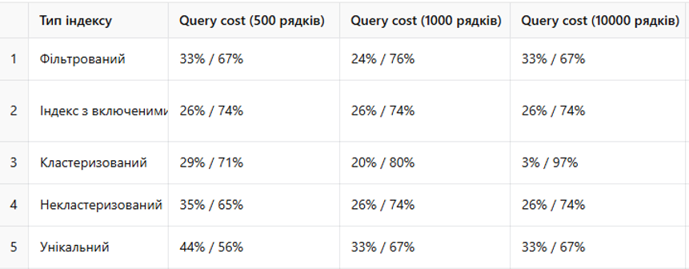

# Лабораторна робота №5 — Індекси, збережені процедури та продуктивність запитів у MSSQL

## 🎯 Мета роботи
Ознайомитися з поняттям індексів у Microsoft SQL Server, вивчити їх призначення, типи, способи створення і оптимізації. Реалізувати роботу з системними, глобальними тимчасовими, локальними тимчасовими та користувацькими збереженими процедурами, зокрема з використанням транзакцій і вихідних параметрів. Також реалізовано процедуру масового додавання та вставку з поверненням ID.

## 📂 Файли у репозиторії
- `QUERY.sql` — усі SQL-скрипти з лабораторної роботи
- `README_Lab5_FULL.md` — документація до виконаної роботи

## ⚙️ Використані типи індексів
1. **Кластеризований індекс** — первинний ключ `EmployeeID` у таблиці `Employee`
2. **Некластеризований індекс** — `AllowanceName` у таблиці `Allowance`
3. **Унікальний індекс** — `PhoneNumber` у таблиці `Employee`
4. **Індекс з включеними стовпцями** — `AllowanceName INCLUDE(Description)` у `Allowance`
5. **Фільтрований індекс** — `EmployeeID=1` з включеними `ErrorType, ErrorDetails` у `ErrorReport`

## 📊 Результати аналізу індексів

Нижче наведено приклад результатів запиту, який дозволяє оцінити фрагментацію індексів у таблицях бази даних: значення фрагментації показують різницю у продуктивності між запитами з використанням індексів та без них, що дозволяє візуально порівняти ефективність.

## 📋 Системні процедури
- `sp_helpindex 'Employee'` — структура індексів
- `sp_spaceused 'Employee'` — використання памʼяті
- `sp_columns 'Employee'` — структура таблиці

## 🔒 Глобальні тимчасові процедури
- `##GetEmployeePaymentsByPeriod(@EmployeeID, @StartPeriod, @EndPeriod)` — виплати працівнику за період
- `##GetPositionAllowances(@PositionID)` — надбавки до посади
- `##GetRecentErrors(@DaysBack)` — помилки за останні N днів

## 📌 Локальні тимчасові процедури
- `#GetAveragePaymentPerEmployee` — середня виплата на працівника
- `#GetEmployeePositionAndSalary` — список працівників і посад
- `#GetAllAllowancesByPosition` — повний список надбавок до посад

## 🧩 Користувацькі процедури (з транзакціями)
- `InsertPaymentWithCheck(@EmployeeID, @Period, @PaymentAmount)` — вставка виплати з перевіркою
- `UpdateSalaryAndLog(@PositionID, @NewSalary)` — оновлення базового окладу
- `TransferEmployee(@EmployeeID, @NewPositionID)` — переведення працівника

## ➕ Додаткові процедури
- `AddEmployeesInBulk(@RowCount)` — масове додавання працівників у `Employee`
- `InsertPositionAndReturnID(@PositionName, @BaseSalary, @NewPositionID OUTPUT)` — додавання посади з поверненням ID

## ✅ Висновки
Під час виконання лабораторної роботи я реалізував створення та аналіз пʼяти типів індексів, оцінив їхню ефективність при різній кількості рядків у таблицях, а також реалізував різні типи збережених процедур, включно з транзакціями та вихідними параметрами. Отримані знання дозволяють оптимізувати структуру бази даних, підвищити продуктивність запитів і краще контролювати логіку бізнес-процесів у SQL Server.